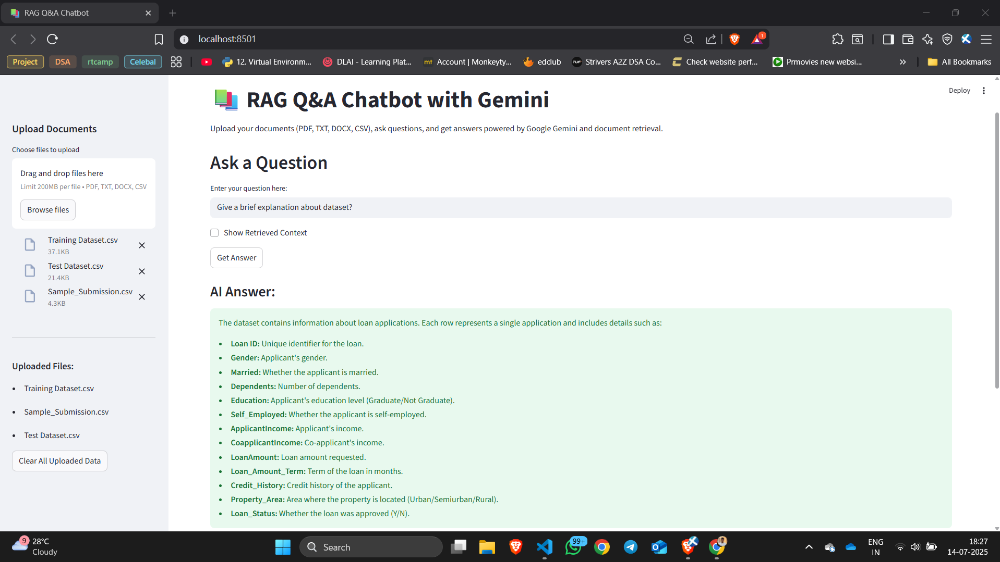
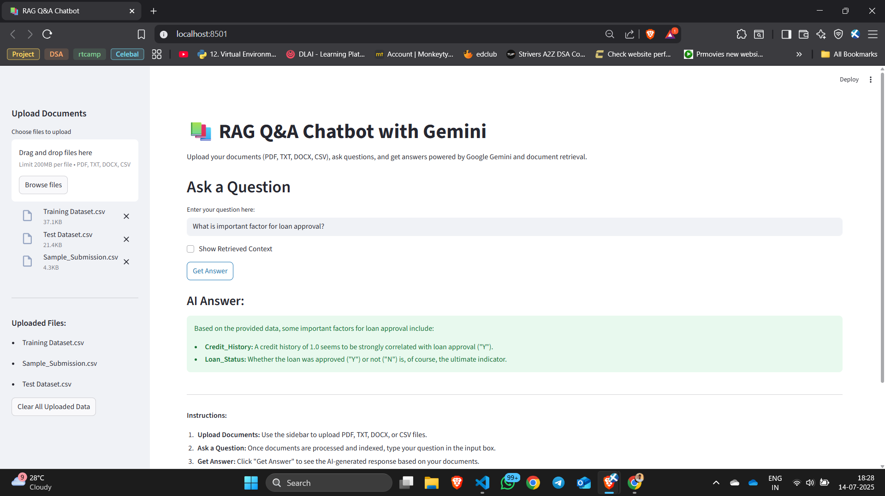

# 📄 🤖 RAG Q&A Chatbot for Loan Approval Dataset

A Retrieval-Augmented Generation (RAG) based chatbot powered by Google Gemini, designed for intelligent Q&A over uploaded documents. The app supports various file formats and provides context-aware responses using the Gemini large language model.

---

**Dataset Resource**: [Kaggle - Loan Approval Prediction](https://www.kaggle.com/datasets/sonalisingh1411/loan-approval-prediction?select=Training+Dataset.csv)


> 📌 **Note**: This project was developed as part of the **Week 8 Assignment** in the **Celebal Summer Internship** program.

---

## 🎥 Demo – Chatbot Screen Recording

> [Download or View Chatbot Demo (MP4)](demo/chatbot_demo.mp4)

### OR 

> [▶️ Watch Demo Video](https://youtu.be/1pLQIomZRI8)


## 🚀 Features

- **Modular Design**: Clean, maintainable code organized into distinct modules:
  - `config.py` – Environment and configuration settings  
  - `utils.py` – File reading, cleaning, and chunking  
  - `retriever.py` – Embedding creation and FAISS-based similarity search  
  - `gemini_qa.py` – Gemini API integration and response generation  
  - `streamlit_app.py` – Streamlit frontend for interactive user experience  


- **Multi-File Support**: Upload and parse PDF, TXT, DOCX, and CSV files  
- **Fast Retrieval**: Uses Sentence Transformers and `faiss-cpu` for efficient chunk retrieval  
- **LLM Integration**: Uses Google Gemini via `google-generativeai` to generate high-quality answers  
- **Session State**: Streamlit session state is used to retain data and avoid redundant processing  
- **Optional Context Viewer**: Toggle to view retrieved context chunks used by the LLM  
- **Basic Error Handling**: Handles missing files, API errors, and corrupted inputs gracefully  

---

## 📁 Project Structure

```
RAG-QnA-chatbot/
│
├── .env                   # Stores your Gemini API key
├── .gitignore             # Prevents sensitive or unnecessary files from being committed
├── config.py              # API key and config loading
├── utils.py               # File reading, cleaning, and text chunking
├── retriever.py           # Embedding and FAISS-based retrieval
├── gemini_qa.py           # Generates answers using Gemini API
├── streamlit_app.py       # Streamlit app interface
├── requirements.txt       # All required Python dependencies
```

---


## 🛠️ Setup Instructions

### 1. Clone the Repo & Navigate to Directory

```bash
git clone https://github.com/ShubhamS168/RAG-QnA-chatbot.git
```

### 2. Create and Configure `.env`

```env
GEMINI_API_KEY="YOUR_GEMINI_API_KEY"
```

> Replace `"YOUR_GEMINI_API_KEY"` with your actual [Google Gemini API key](https://aistudio.google.com/app/apikey).

### 3. Create `.gitignore`

```gitignore
.env
__pycache__/
.DS_Store
*.pyc
```

### 4. Install Requirements

```bash
pip install -r requirements.txt
```

---

## ▶️ Run the App

Start the Streamlit app:

```bash
streamlit run streamlit_app.py
```

---
In your terminal click on *Local URL: http://localhost:8501* to launch app
```
(venv) G:\Download\RAG-QnA-chatbot>streamlit run streamlit_app.py

  You can now view your Streamlit app in your browser.

  Local URL: http://localhost:8501
  Network URL: http://10.19.17.113:8501
  External URL: http://223.228.149.133:8501
```
---
Once the app launches in your browser, you can:

1. Upload documents (PDF, TXT, DOCX, CSV).
2. Ask any question based on their content.
3. View the LLM-generated answer and optionally the supporting context.

---


## 📸 UI Preview

> _Add screenshots of the Streamlit interface and output here.


*Figure 1: 🧾 The chatbot explains the structure of the uploaded loan dataset, listing all features such as Loan ID, Gender, ApplicantIncome, and more in response to a user query.*

---

*Figure 2: ✅ The chatbot identifies key factors influencing loan approval—highlighting Credit_History and Loan_Status—based on analysis of the dataset.*

---

## 📦 Requirements

```
streamlit
python-dotenv
pandas
docx2txt
PyMuPDF
google-generativeai
sentence-transformers
faiss-cpu
```

---

## ✅ Summary

| Component       | Description                                          |
|----------------|------------------------------------------------------|
| **Frontend**    | Streamlit dashboard with file uploader and chat box |
| **Embedding**   | Sentence Transformers + FAISS index                 |
| **LLM**         | Google Gemini via `google-generativeai` SDK        |
| **Persistence** | Streamlit Session State for caching results         |
| **Security**    | API key stored securely in `.env`                   |

---

## 📬 Credits

- **Author**: [**Shubham Sourav**](https://github.com/ShubhamS168) - *Data Science Intern at Celebal Technologies*
- **Dataset**: Use any datasets
- **Resources Used**:
  - [Streamlit Docs](https://docs.streamlit.io/)
  - [Machine Learning Mastery – Streamlit Guide](https://machinelearningmastery.com/how-to-quickly-deploy-machine-learning-models-streamlit/)


---


## 📚 Project Goal Reminder

**RAG Q&A Chatbot with Generative AI**

The objective of this project is to **build and deploy a Retrieval-Augmented Generation (RAG) chatbot** using Streamlit that intelligently answers user questions based on uploaded documents. Leveraging both embedding-based retrieval and powerful generative models, the system aims to:

- 📁 Let users **upload documents** (e.g., PDFs, CSVs, DOCX, TXT)
- 🧠 Use **retrieval techniques (FAISS + embeddings)** to fetch relevant context from the uploaded files
- ✨ Generate **context-aware answers** using LLMs (e.g., Gemini, OpenAI, Claude, Grok, or lightweight Hugging Face models)
- 💬 Offer an **interactive Streamlit interface** for uploading files and querying them
- ✅ Work even with **limited/free access APIs** to ensure cost-efficiency and accessibility

This chatbot is tested with real-world data like the [Loan Approval Prediction dataset on Kaggle](https://www.kaggle.com/datasets/sonalisingh1411/loan-approval-prediction?select=Training+Dataset.csv), making it a robust example of combining NLP, document understanding, and LLM deployment for real applications.


---

## 📬 Contact

For any queries, feedback, or collaboration, feel free to connect:

📧 **Email:** [shubhamsourav475@gmail.com](mailto:shubhamsourav475@gmail.com)

---

> 📝 **Note:**  
> This repository is maintained as part of the CSI (Celebal Summer Internship) program and is intended for educational use.

## 🪪 License

Distributed under the MIT License.  
© 2025 Shubham Sourav. All rights reserved.